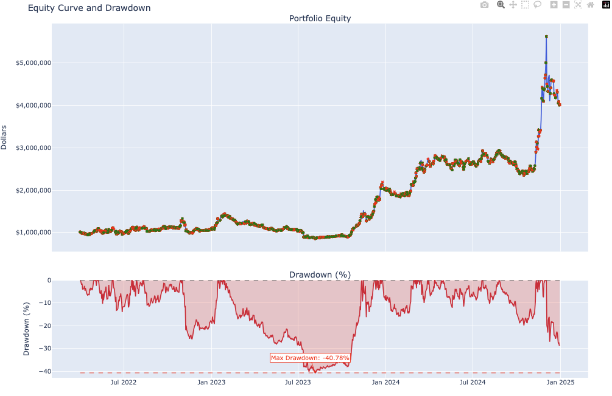

# Trading Infra Demo

This is a toy example from my proprietary trading infrastructure. 
The goal is to use ML (black box) to predict market environment, then use traditional portfolio construction technique (white box) to trade the signals the model generated.

## Content

1. You can use the `CryptoMarketData` class to pull candle stick data from binance.
2. A pipelined classifier using CatBoost in `ModelTraining.py`.
3. A simple backtest engine to backtest your strategy.

## Example Usage
[Demo1: Long-short Momentum Strategy](./Examples/Demo1.ipynb)

## Contributing

Contributions and collabrations are welcome! 
Please open an issue or submit a pull request for any improvements or bug fixes.

Also feel free to reach out to me if you want to discuss this project in more details.

## License

This project is licensed under the MIT License. See the LICENSE file for more details.

